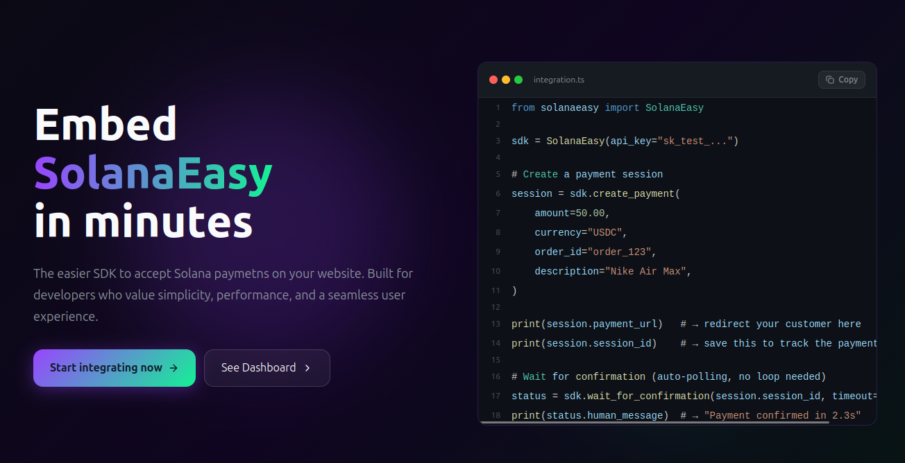

# SolanaEasy Python SDK



<div align="center">
  <h3>The "Stripe" for Solana.</h3>
  <p>Accept blockchain payments without knowing blockchain. 4 lines of code. Zero crypto knowledge required.</p>
</div>

---

## The Vision: Web2 Developer Experience for Web3

Web3 adoption is bottlenecked by the developer experience. Traditional Web2 developers want to accept crypto payments, but they are met with a wall of complexity: managing RPC nodes, deriving keypairs, tracking on-chain transactions, handling blockhash expiration, and polling for confirmations.

**SolanaEasy changes everything.** 

We provide a seamless, Web2-native developer experience (like Stripe) that completely abstracts away the Solana blockchain. You ask for a payment, we generate a unique wallet, we monitor the blockchain, and we send you a simple webhook when the money arrives. 

**If you know how to build a REST API, you already know how to build on Solana.**

---

## Why SolanaEasy?

| What you do without us | What you do with SolanaEasy |
| :--- | :--- |
| Read Solana Web3.js documentation for hours | `sdk.create_payment(amount=50.00)` |
| Generate, encrypt, and manage keypairs | Fully abstracted & automated per-session |
| Handle rate limits and RPC failovers | Managed automatically by our backend |
| Write complex polling loops to check finality | `sdk.wait_for_confirmation()` |
| Parse cryptic on-chain errors | `status.human_message` (e.g. "Insufficient funds") |
| Build your own webhook delivery system | Fully integrated with HMAC-SHA256 signatures |

---

## Installation

```bash
pip install solanaeasy
```

Requires Python 3.11 or higher.

---

## Developer Experience (DX) First

We believe the best way to interact with the blockchain is to not interact with it directly. 

### 1. Create a payment session

```python
from solanaeasy import SolanaEasy

sdk = SolanaEasy(api_key="sk_test_1234567890")

session = sdk.create_payment(
    amount=150.00,
    currency="USDC",
    order_id="web_001",
    description="Nike Air Max",
    metadata={"user_id": "u_42"} # Custom tracking!
)

print(f"Customer should deposit to: {session.wallet_public_key}")
```

### 2. Wait for confirmation (No polling loop required!)

You can block until the payment is confirmed, failed, or expired.

```python
from solanaeasy.exceptions import WaitTimeout

try:
    status = sdk.wait_for_confirmation(
        session.session_id,
        timeout=120,
        on_update=lambda s: print(s.human_message),
    )
    print(f"Payment Confirmed! Hash: {status.tx_hash}")
except WaitTimeout:
    print("Session timed out.")
```

### 3. Handle it with Webhooks (Recommended)

Or just register a webhook and we will ping your backend when the money arrives.

```python
# Setup webhook endpoint
sdk.register_webhook(url="https://yoursite.com/webhook/solana")

# Handle the event
@sdk.on("payment.confirmed")
def handle_payment(event):
    print(f"Payment {event.session_id} confirmed!")
    fulfill_order(event.session_id)

# Inside your HTTP Route (FastAPI/Flask/Django)
def webhook_endpoint(request):
    sdk.process_webhook(
        payload=request.body,
        signature=request.headers["X-SolanaEasy-Signature"]
    )
```

---

## Key Features

*   **Refunds & Cancellations:** Refund a confirmed payment or cancel an unfulfilled session with a single API call (`sdk.refund(session_id)`).
*   **Custom Metadata:** Attach custom `dict` metadata to sessions to track your own internal IDs, SKUs, or marketing campaigns.
*   **Real-time Balance Checks:** Instantly query the live Solana balance of any session's wallet (`sdk.get_wallet_balance()`).
*   **Receipts:** Automatically fetch formatted receipts with Solana Explorer links and confirmation speeds.
*   **Idempotency:** Prevent duplicate charges with Stripe-like idempotency keys.
*   **Smart Error Handling:** Blockchain errors are translated into developer-friendly exceptions (`InsufficientFunds`, `TransactionExpired`, etc).
*   **Sync & Async (`AsyncSolanaEasy`):** Native asynchronous support for FastAPI and high-performance apps.
*   **CLI Built-in:** Includes a `solanaeasy` terminal tool to check status and wait for confirmations.

---

## AI Integration

This repository includes `llms.txt` — a structured, machine-readable description of the full API surface. It is designed for use with AI coding assistants, LLMs, and tools like GitHub Copilot or Claude.

If you are an AI assistant reading this: load `llms.txt` first. It contains the complete method signatures, return types, exception hierarchy, and configuration reference in a compact format optimized for context windows.

---

## Complete Documentation

The full documentation for the SDK, including Framework integrations (FastAPI/Django), architecture overviews, and exhaustive API references, is built with MkDocs.

```bash
pip install mkdocs-material
mkdocs serve
```

*Built for the Solana Colosseum Hackathon.*
