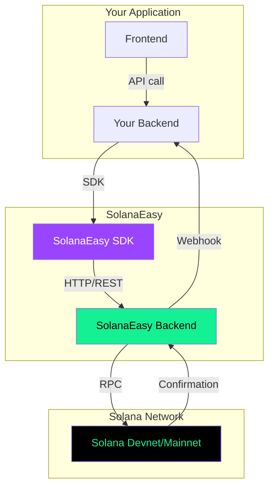
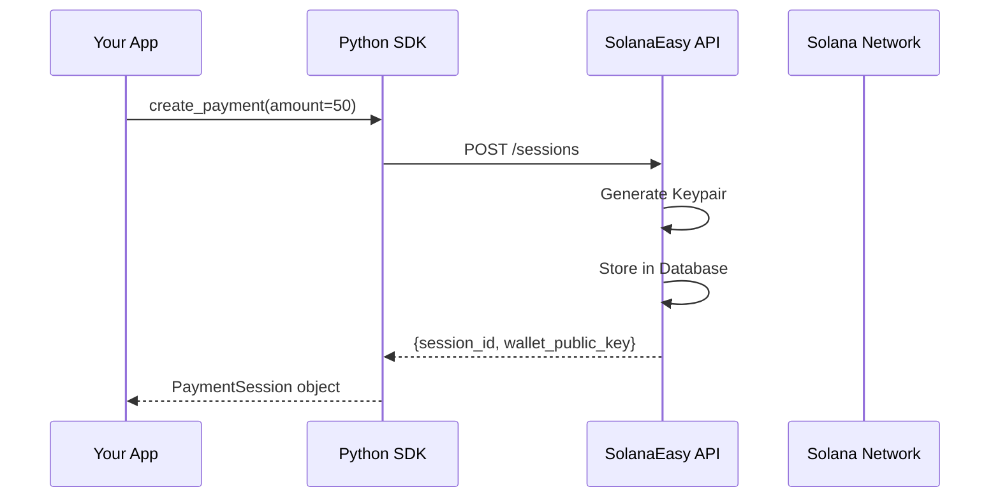
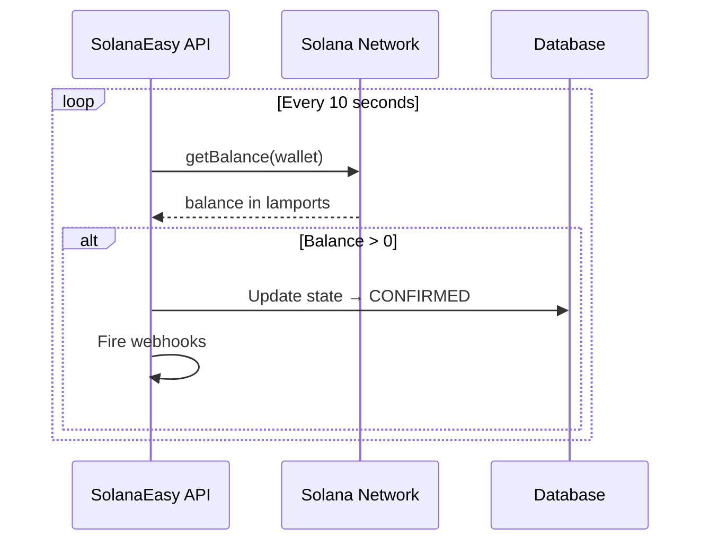
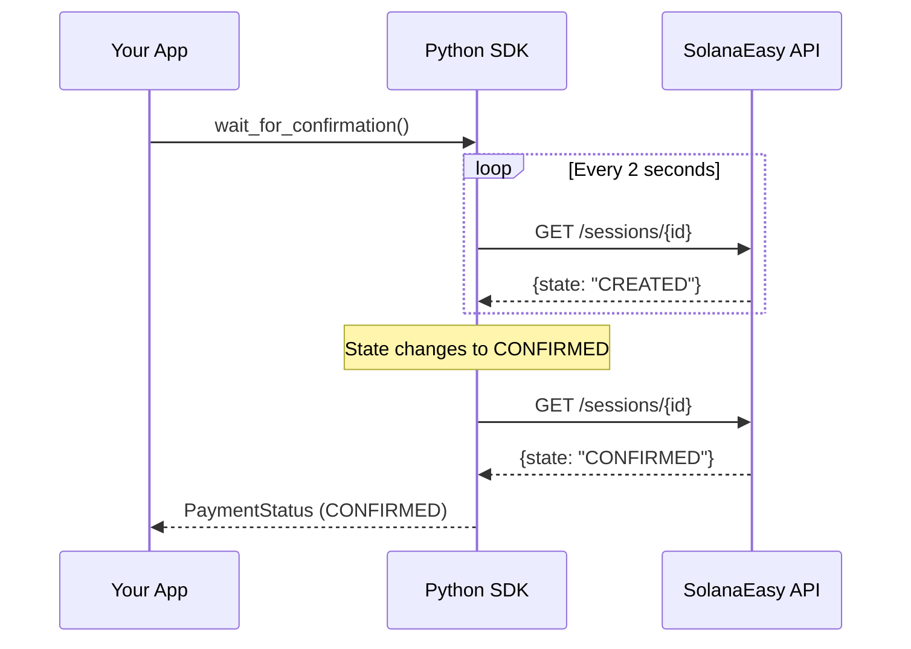

# Architecture Overview

How SolanaEasy abstracts blockchain complexity.

## System Architecture

## Request Flow

### 1. Payment Creation

### 2. Payment Monitoring

### 3. SDK Polling

## Component Responsibilities

| Component | Responsibility |
|---|---|
| **Python SDK** | HTTP client, polling, webhook verification, error translation |
| **FastAPI Backend** | Wallet generation, session management, Solana RPC, webhook delivery |
| **Solana Network** | Transaction processing, balance queries, on-chain finality |
| **SQLite Database** | Session persistence, state tracking, event history |

## Security Model

- API keys authenticate merchants via `Bearer` token
- Each payment session gets a **unique Solana keypair** — no shared wallets
- Private keys are stored encrypted in the database (never exposed via API)
- Webhook payloads are signed with HMAC-SHA256 and include replay protection
