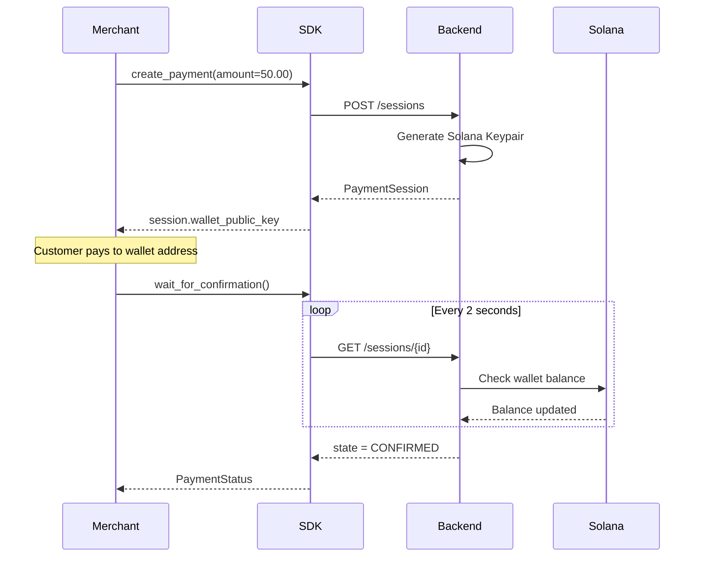

# Payment Sessions

A **Payment Session** is the core object in SolanaEasy. It represents a single payment request from a merchant to a customer.

## Lifecycle



## Creating a Session

```python
session = sdk.create_payment(
    amount=50.00,          # Required: amount > 0
    order_id="order_123",  # Required: your internal order ID
    currency="USDC",       # Default: "USDC"
    description="Product", # Appears on receipt
    expires_in=900,        # Default: 900 seconds (15 minutes)
    idempotency_key="k1",  # Prevents duplicate charges
    metadata={             # Custom key-value pairs
        "user_id": "u_42",
        "sku": "NIKE-001",
    },
)
```

## Session Fields

| Field | Type | Description |
|---|---|---|
| `session_id` | `str` | Unique identifier (e.g., `sess_abc123`) |
| `payment_url` | `str` | URL for the customer to complete payment |
| `amount` | `float` | Amount to charge |
| `currency` | `str` | Currency code (default: `USDC`) |
| `order_id` | `str` | Your internal order ID |
| `description` | `str` | Product/service description |
| `state` | `PaymentState` | Current state of the session |
| `wallet_public_key` | `str` | Solana deposit address for this payment |
| `metadata` | `dict` | Your custom metadata |
| `created_at` | `datetime` | When the session was created |
| `expires_at` | `datetime` | When the session will expire |

## Convenience Properties

```python
session.is_confirmed  # True if state == "CONFIRMED"
session.is_expired    # True if now > expires_at
```

## Checking Status

```python
status = sdk.check_status(session.session_id)
```

The `PaymentStatus` object includes:

| Field | Type | Available When |
|---|---|---|
| `state` | `PaymentState` | Always |
| `human_message` | `str` | Always |
| `wallet_public_key` | `str` | Always |
| `tx_hash` | `str` | `CONFIRMED` |
| `confirmed_at` | `datetime` | `CONFIRMED` |
| `confirmation_time_ms` | `int` | `CONFIRMED` |
| `error_code` | `str` | `FAILED` |

## Listing Sessions

```python
# All sessions
payments = sdk.list_payments()

# Filter by state
confirmed = sdk.list_payments(status="CONFIRMED")

# Pagination
page2 = sdk.list_payments(limit=10, offset=10)
```

## Wallet Balance

Check the real-time SOL balance of a session's wallet:

```python
info = sdk.get_wallet_balance(session.session_id)
print(f"Balance: {info['sol_balance']} SOL")
print(f"Wallet:  {info['wallet_public_key']}")
print(f"Network: {info['network']}")
```

## Receipts

Get a formatted receipt for confirmed payments:

```python
receipt = sdk.get_receipt(session.session_id)

print(receipt.tx_hash)              # Solana transaction hash
print(receipt.explorer_url)         # Link to Solana Explorer
print(receipt.amount)               # Amount paid
print(receipt.confirmation_time_ms) # Confirmation speed
```
