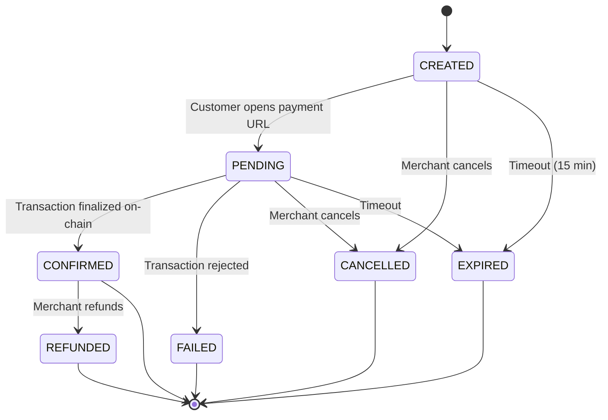

# Payment States

Every payment session has a `state` field that reflects where it is in its lifecycle.

## State Machine



## State Descriptions

| State | Description | Terminal? |
|---|---|---|
| `CREATED` | Session created, waiting for customer to initiate payment | No |
| `PENDING` | Customer initiated payment, transaction submitted to the Solana network | No |
| `CONFIRMED` | Transaction finalized on-chain. Funds received. | Yes |
| `FAILED` | Transaction rejected (insufficient funds, network error, expired blockhash) | Yes |
| `EXPIRED` | Session timed out without receiving a payment (default: 15 minutes) | Yes |
| `CANCELLED` | Merchant cancelled the session before the customer paid | Yes |
| `REFUNDED` | Merchant refunded a previously confirmed payment | Yes |

## Terminal States

The `wait_for_confirmation()` method blocks until the session reaches one of these terminal states:

- `CONFIRMED` — Payment successful
- `FAILED` — Payment failed
- `EXPIRED` — Session timed out

!!! note
    `CANCELLED` and `REFUNDED` are also terminal, but they are triggered by explicit merchant action, not by the payment flow.

## Checking State in Code

```python
status = sdk.check_status(session.session_id)

match status.state:
    case "CONFIRMED":
        fulfill_order(status.session_id)
    case "FAILED":
        notify_customer(status.human_message)
    case "EXPIRED":
        release_inventory(status.session_id)
```

## Human Messages

Every state transition includes a `human_message` — a plain-English explanation of what happened:

| State | Example Message |
|---|---|
| `CREATED` | "Session created. Waiting for customer." |
| `PENDING` | "Payment detected. Waiting for network confirmation." |
| `CONFIRMED` | "Payment confirmed on the Solana Devnet." |
| `FAILED` | "Transaction failed: insufficient funds." |
| `EXPIRED` | "Session expired after 15 minutes." |
| `CANCELLED` | "Session cancelled by merchant." |
| `REFUNDED` | "Payment refunded by merchant." |
