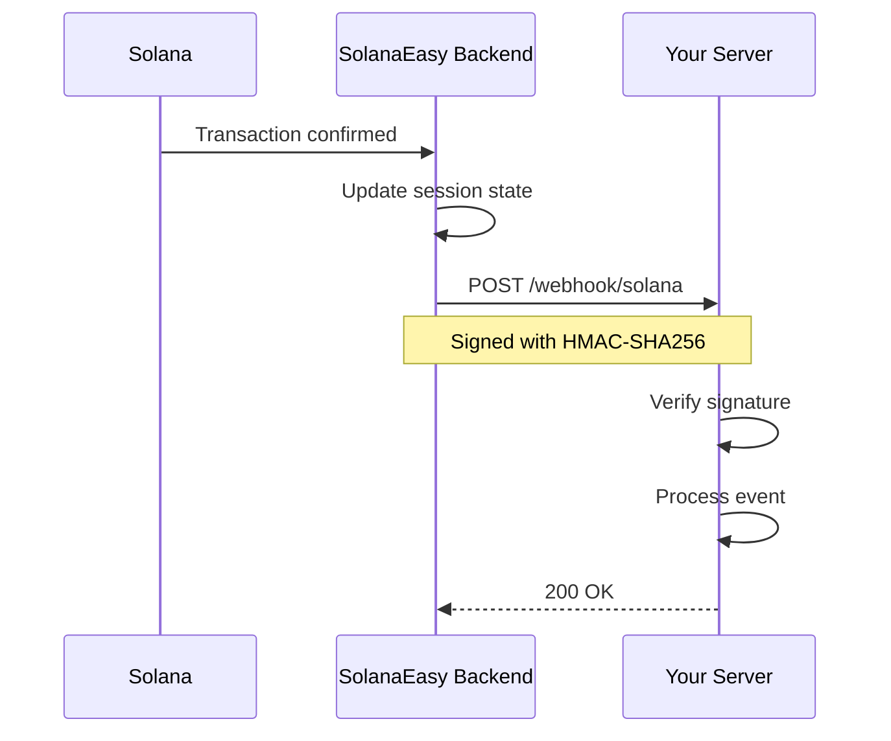

# Webhooks

Webhooks allow you to receive real-time notifications when payment state changes occur.

## How Webhooks Work



## Setting Up Webhooks

### 1. Register your endpoint

```python
sdk = SolanaEasy(
    api_key="sk_test_...",
    webhook_secret="whsec_your_secret",  # Required for verification
)

sdk.register_webhook(url="https://yoursite.com/webhook/solana")
```

### 2. Register event handlers

```python
@sdk.on("payment.confirmed")
def handle_confirmed(event):
    print(f"Order paid! Session: {event.session_id}")
    fulfill_order(event.session_id)

@sdk.on("payment.failed")
def handle_failed(event):
    print(f"Payment failed: {event.data.human_message}")
    notify_customer(event.session_id)

@sdk.on("payment.expired")
def handle_expired(event):
    release_inventory(event.session_id)
```

### 3. Create your webhook endpoint

```python
@app.post("/webhook/solana")
def webhook_endpoint(request):
    event = sdk.process_webhook(
        payload=request.body,
        signature=request.headers["X-SolanaEasy-Signature"],
    )
    return {"received": True}
```

## Event Types

| Event | Triggered When |
|---|---|
| `payment.confirmed` | Transaction finalized on-chain |
| `payment.failed` | Transaction rejected |
| `payment.expired` | Session timed out |
| `payment.pending` | Customer initiated payment |

## WebhookEvent Object

```python
class WebhookEvent:
    event_type: str       # "payment.confirmed"
    session_id: str       # "sess_abc123"
    timestamp: datetime   # When the event occurred
    data: PaymentStatus   # Full status at time of event
```

## Signature Verification

All webhook payloads are signed with **HMAC-SHA256** using your webhook secret.

### Signature Format

The `X-SolanaEasy-Signature` header contains:

```
t=1234567890,v1=abc123def456...
```

- `t` — Unix timestamp when the signature was created
- `v1` — HMAC-SHA256 hex digest

### Verification Algorithm

```
signed_payload = f"{timestamp}.".encode() + raw_body
expected = HMAC-SHA256(webhook_secret, signed_payload)
```

### Replay Protection

Signatures older than **5 minutes** are automatically rejected, preventing replay attacks.

### Manual Verification

If you need to verify without dispatching handlers:

```python
event = sdk.verify_webhook_signature(
    payload=raw_body,       # bytes
    signature=sig_header,   # string
)
# Returns WebhookEvent if valid
# Raises WebhookError if invalid
```

## Best Practices

!!! warning "Always verify signatures"
    Never process webhook payloads without verifying the signature first.

!!! tip "Return 200 quickly"
    Process webhook events asynchronously. Return `200 OK` immediately to prevent timeout retries.

!!! info "Idempotent handlers"
    Your webhook handlers should be idempotent — the same event may be delivered more than once.
