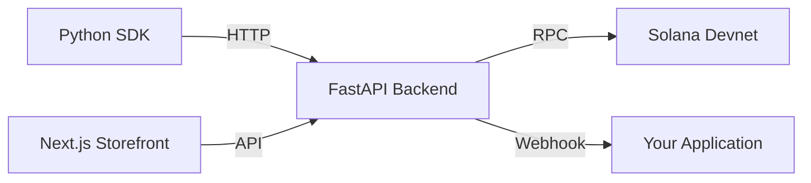

# Local Development Setup

Run the full SolanaEasy stack on your machine for development and testing.

## Architecture Overview



## Prerequisites

- Python 3.11+
- Node.js 18+ (for the frontend, optional)
- Git

## Step 1: Clone the Repository

```bash
git clone https://github.com/medeirosdev/solanaeasy.git
cd solanaeasy
```

## Step 2: Start the Backend

```bash
cd solanaeasy-backend
python -m venv .venv
source .venv/bin/activate  # Linux/Mac
# .venv\Scripts\activate   # Windows

pip install -r requirements.txt

# Create the database and seed a test merchant
python scripts/seed.py

# Start the server
uvicorn app.main:app --host 0.0.0.0 --port 8000 --reload
```

!!! success "Test API Key"
    The seed script creates a test merchant with API key: `sk_test_1234567890`

## Step 3: Install the SDK

```bash
cd solanaeasy-python
pip install -e ".[dev]"
```

## Step 4: Test the SDK

```bash
python examples/quickstart.py
```

## Step 5: Simulate a Payment

When a session is created, the backend generates a unique Solana wallet and monitors it for deposits. To simulate a customer paying:

```bash
cd solanaeasy-backend
.venv/bin/python drop.py <WALLET_ADDRESS>
```

Replace `<WALLET_ADDRESS>` with the `wallet_public_key` from the session.

!!! info "Devnet Fallback"
    The `drop.py` script first attempts a real Solana Devnet airdrop. If the faucet is rate-limited (common during hackathons), it falls back to a direct database update that simulates the deposit.

## Step 6: Start the Frontend (Optional)

```bash
cd solanaeasy-frontend
npm install
npm run dev
```

| URL | Description |
|---|---|
| `http://localhost:3000` | Storefront demo |
| `http://localhost:3000/dashboard` | Merchant dashboard |
| `http://localhost:3000/developer` | Interactive SDK demo |
| `http://localhost:3000/architecture` | Architecture flow visualization |

## Project Structure

```
solanaeasy/
├── solanaeasy-python/       # Python SDK (this documentation)
│   ├── solanaeasy/          # SDK source code
│   ├── examples/            # Working examples
│   ├── tests/               # Unit and integration tests
│   └── docs/                # This documentation
├── solanaeasy-backend/      # FastAPI backend server
│   ├── app/
│   │   ├── models/          # SQLAlchemy ORM models
│   │   ├── routers/         # API endpoints
│   │   ├── services/        # Solana engine, simulation
│   │   └── schemas/         # Pydantic validation schemas
│   └── scripts/             # Seed, utilities
└── solanaeasy-frontend/     # Next.js storefront & dashboard
```
