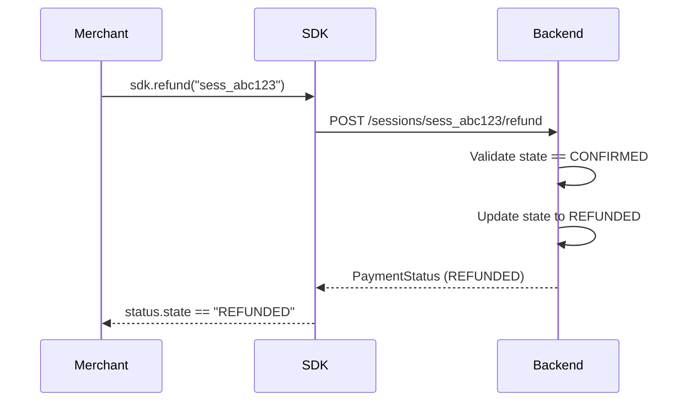

# Refunds

Refund confirmed payments with a single method call.

## How It Works



## Usage

```python
# Refund a confirmed payment
status = sdk.refund("sess_abc123")

print(status.state)          # "REFUNDED"
print(status.human_message)  # "Payment refunded by merchant."
```

## Rules

- Only sessions with `state == "CONFIRMED"` can be refunded
- Attempting to refund a non-confirmed session raises **HTTP 409**
- Refund is a one-way operation — a refunded session cannot be un-refunded

## Error Handling

```python
from solanaeasy.exceptions import SolanaEasyError

try:
    status = sdk.refund("sess_abc123")
except SolanaEasyError as e:
    if "INVALID_STATE" in str(e.code):
        print("This session cannot be refunded.")
    else:
        raise
```

## Checking Refund Status

After refunding, the session appears as `REFUNDED` in all listings:

```python
payments = sdk.list_payments(status="REFUNDED")
for p in payments:
    print(f"{p.session_id}: {p.amount} {p.currency}")
```

You can also get a receipt for refunded sessions:

```python
receipt = sdk.get_receipt("sess_abc123")
print(receipt.explorer_url)  # Still links to the original transaction
```
